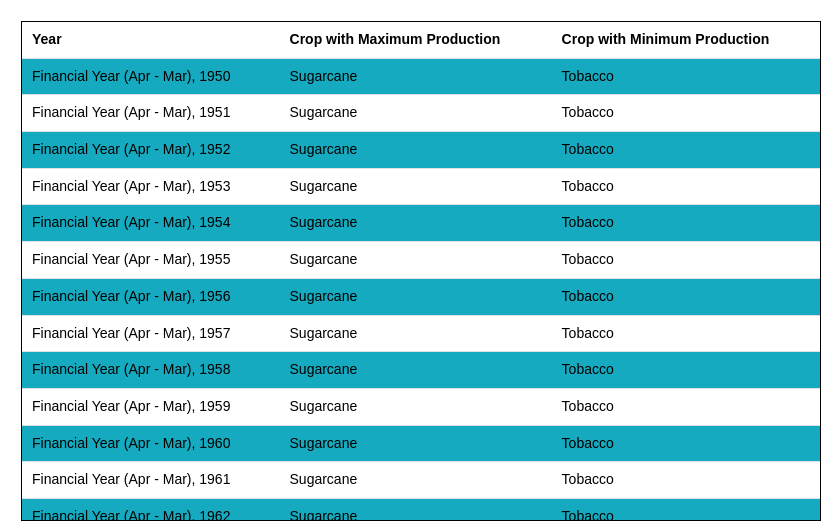

# Data Analysis Task

This project utilizes React to create two tables for visualizing and analyzing agricultural crop data from a JSON file.

Available Scripts

In the project directory, you can run:

`yarn`
Install all dependencies

`yarn start`
Runs the app in the development mode.
Open http://localhost:3000 to view it in the browser.

The page will reload if you make edits.
You will also see any lint errors in the console.

`yarn test`
Launches the test runner in the interactive watch mode.
See the section about running tests for more information.

`yarn build`
Builds the app for production to the build folder.
It correctly bundles React in production mode and optimizes the build for the best performance.

The build is minified and the filenames include the hashes.
Your app is ready to be deployed!

# Tables

**NOTE - Use the toggle button to switch between tables**

Table 1 -

Table 2 -

